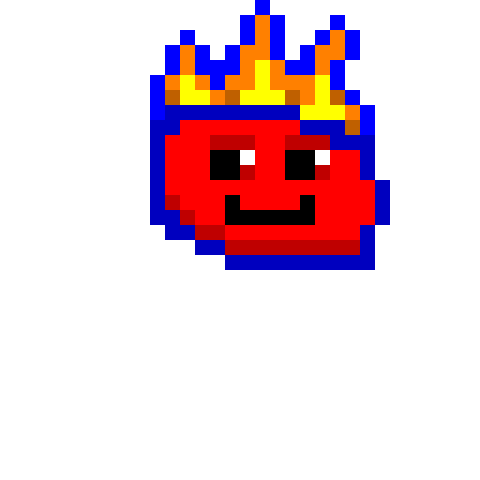

# PokeClone

A Pygame-based monster battling game featuring unique creatures with elemental types and special moves, along with an advanced pixel art editor for creating and editing sprites.

 <!-- TODO: Add actual screenshot -->

## 🎮 Features

### Core Gameplay
- **Turn-based Combat System**: Engage in strategic battles where type advantages play a crucial role.
- **28 Unique Monsters**: Each monster comes with distinct stats and movesets.
- **80+ Different Moves**: A wide array of attacks and effects to enhance battles.
- **15 Elemental Types**: Diverse types with complex interactions to add depth to combat.
- **Stat Modification**: Utilize strategic buff and debuff mechanics to gain the upper hand.

### Pixel Art Editor
- **Advanced Editing Tools**: Selection, copy-paste, mirroring, and rotating tools for precise sprite editing.
- **Customizable Brush Sizes**: Adjust brush sizes to suit different editing needs.
- **Scrollable Color Palette**: Access a comprehensive range of colors for detailed sprite creation.
- **Sprite Management**: Easily switch between front and back sprites for each monster.
- **Undo/Redo Functionality**: Revert or reapply changes with ease.
- **Integration with Game**: Seamlessly create and edit sprites that integrate directly into the game.

### Elemental Types
- 🔥 Fire
- 💧 Water
- 🌍 Earth
- 💨 Wind
- ⚡ Electric
- ❄️ Ice
- 🌿 Nature
- 🧠 Mind
- 👻 Shadow
- ✨ Light
- 🔧 Metal
- ☠️ Toxic
- 🔊 Sound
- 💎 Crystal
- 🌌 Cosmic

## 🚀 Getting Started

### Prerequisites
- **Python 3.6+**
- **Pygame library**
- **Tkinter** (usually included with Python)
- **Graphics card with OpenGL support** (recommended for optimal performance)

### Installation

1. **Clone the repository:**
    ```bash
    git clone https://github.com/yourusername/pokeclone.git
    cd pokeclone
    ```

2. **Create and activate a virtual environment (recommended):**
    ```bash
    python -m venv venv
    source venv/bin/activate  # On Windows: venv\Scripts\activate
    ```

3. **Install required dependencies:**
    ```bash
    pip install -r requirements.txt
    ```

### Running the Game
```bash
python battle_simulator.py
```

### Using the Pixel Art Editor
1. **Run the Pixel Art Editor:**
    ```bash
    python pixel_art_editor.py
    ```

2. **Create or Edit Sprites:**
    - **Select Editing Mode:** Choose between editing monster sprites or background images.
    - **Use Tools:** Utilize selection, brush, eraser, fill, and other tools to create detailed pixel art.
    - **Save Your Work:** Save your edited sprites, which will be used in the main game.

## 🎯 Game Mechanics

### Battle System
- **Turn-based Combat**: Players and opponents take turns selecting moves to attack or apply effects.
- **Type Effectiveness Multipliers**: Deals more or less damage based on the interaction between elemental types.
- **Switching Turns**: After a player uses a move, the opponent selects a move to respond.

### Stats System
- **HP (Health Points)**: Determines how much damage a creature can take before being defeated.
- **Attack**: Influences the damage dealt by physical moves.
- **Defense**: Reduces incoming physical damage.
- **Type Advantages/Disadvantages**: Certain types are stronger or weaker against others, affecting damage calculations.

### Move Categories
- **Damage Moves**: Deals direct damage with type advantages.
- **Buff Moves**: Enhances the user's stats.
- **Debuff Moves**: Reduces the opponent's stats.

## 🗂️ Project Structure

```
pokeclone/
├── battle_simulator.py     # Entry point script for the battle simulator
├── pixle_art_editor.py     # Entry point script for the pixel art editor
├── requirements.txt        # Project dependencies
├── README.md               # This file
├── LICENSE                 # MIT License (Assumed, add if exists)
├── ToDo.md                 # KANBAN/ToDo list
├── scripts/                # Utility and conversion scripts
│   ├── convert_sprites.py
│   └── ...
├── src/                    # Main source code directory
│   ├── __init__.py         # Makes src a package
│   ├── core/               # Core components (config, event handling)
│   │   ├── __init__.py
│   │   ├── config.py
│   │   └── event_handler.py
│   ├── battle/             # Battle simulator logic
│   │   ├── __init__.py
│   │   └── battle_simulator.py
│   ├── editor/             # Pixel art editor logic and UI
│   │   ├── __init__.py
│   │   ├── pixle_art_editor.py
│   │   ├── editor_ui.py
│   │   ├── sprite_editor.py
│   │   └── ... (tool_manager, selection_manager, etc.)
│   └── ui/                 # General UI components (if any)
│       ├── __init__.py
│       └── ui_manager.py
├── data/                   # Game data files
│   ├── monsters.json       # Monster definitions
│   ├── moves.json          # Move definitions
│   └── type_chart.json     # Type effectiveness data
├── sprites/                # Monster sprite images (native resolution)
│   └── ...
├── sprites_backup/         # Backups of original sprites (if conversion script used)
│   └── ...
├── backgrounds/            # Battle background images
│   └── ...
├── sounds/                 # Game sound effects
│   └── ...
├── songs/                  # Background music tracks
│   └── ...
└── tests/                  # Unit and integration tests
    ├── __init__.py
    ├── test_battle_simulator.py
    └── ...
```

## 🎮 Controls

### In-Game Controls
- **Mouse Controls**
  - **Left Click**: Select options and moves.

### Pixel Art Editor Controls
- **Mouse Controls**
  - **Left Click**: Select pixels or interact with UI elements.
  - **Right Click**: Activate eraser mode.
  - **Scroll Wheel**: Zoom in and out.
- **Keyboard Shortcuts**
  - **Ctrl + Z**: Undo.
  - **Ctrl + Y**: Redo.
  - **Ctrl + S**: Save current work.
  - **Ctrl + O**: Open a background file.
  - **Ctrl + C**: Copy selected area.
  - **Ctrl + V**: Paste copied area.
  - **Ctrl + M**: Mirror selected area.
  - **Ctrl + R**: Rotate selected area.
  - **+/-**: Increase or decrease brush size.
  - **ESC**: Exit selection mode.

## 🛠️ Development

### Building from Source
```bash
git clone https://github.com/yourusername/pokeclone.git
cd pokeclone
pip install -r requirements.txt
python battle_simulator.py
```

### Contributing
1. **Fork the repository**
2. **Create a feature branch**
    ```bash
    git checkout -b feature/AmazingFeature
    ```
3. **Commit your changes**
    ```bash
    git commit -m 'Add AmazingFeature'
    ```
4. **Push to the branch**
    ```bash
    git push origin feature/AmazingFeature
    ```
5. **Open a Pull Request**

## 📝 License

This project is licensed under the MIT License - see the [LICENSE](LICENSE) file for details.

## 🤝 Contributing

Contributions are welcome! Please feel free to submit a Pull Request. For major changes, please open an issue first to discuss what you would like to change.

## 🐛 Bug Reports

Please use the GitHub Issues tab to report bugs. Include:
- Expected behavior
- Actual behavior
- Steps to reproduce
- Python/Pygame versions
- Operating system

## ✨ Acknowledgments

- All monster and move names are original creations.
- Inspired by classic monster-battling games.
- Thanks to Anthropic and OpenAI for their excellent assistants.

## 📚 Documentation

Coming Soon 

---

Made with ❤️ by Thomas Kolarik, Claude, ChatGPTo1-mini